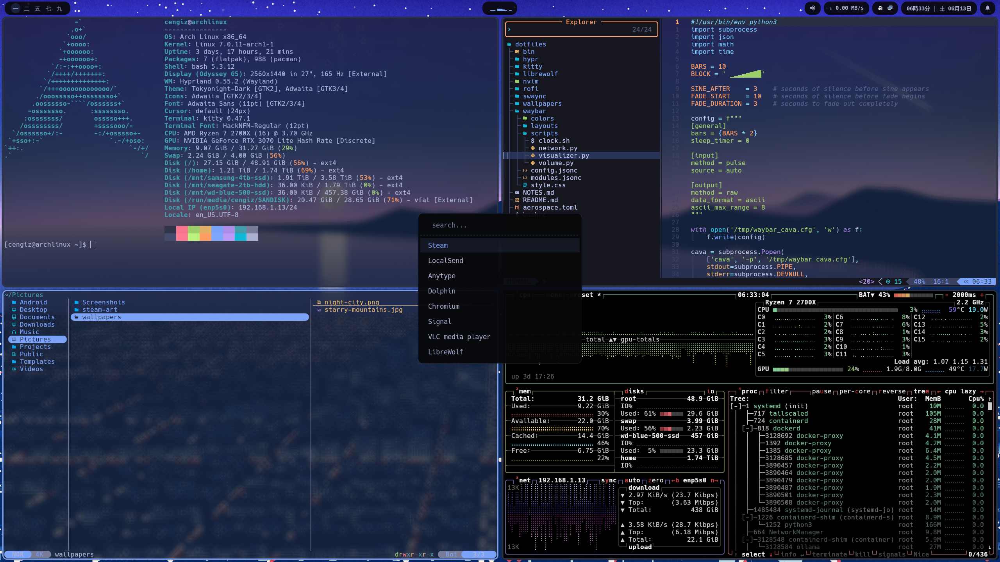

# dotfiles

Hyprland desktop on Arch Linux, themed with Tokyo Night.



## Setup

There is no bootstrap script. Clone the repo and copy each config into the
location shown below, then install the matching packages.

```bash
git clone https://github.com/cengizozel/dotfiles.git
```

## Configs

| Path | Installs to |
|------|-------------|
| `hypr/` | `~/.config/hypr/` |
| `waybar/` | `~/.config/waybar/` |
| `swaync/` | `~/.config/swaync/` |
| `rofi/` | `~/.config/rofi/` |
| `kitty/` | `~/.config/kitty/` |
| `nvim/` | `~/.config/nvim/` |
| `bashrc` | `~/.bashrc` |
| `bin/rofi-click-away` | `~/.local/bin/rofi-click-away` |
| `wallpapers/` | `~/Pictures/wallpapers/` |
| `librewolf/userChrome.css` | `~/.config/librewolf/librewolf/<profile>/chrome/userChrome.css` |
| `aerospace.toml` | `~/.aerospace.toml` (macOS, see note below) |

`aerospace.toml` is for [AeroSpace](https://github.com/nikitabobko/AeroSpace), a
tiling window manager for macOS. It is kept here so all configs live in one place.

## Keybinds

### Apps

| Keybind | Action |
|---------|--------|
| `Super+T` | Terminal (kitty) |
| `Super+E` | File manager (yazi) |
| `Super+B` | Browser (librewolf) |
| `Super+C` | Messaging (signal-desktop) |
| `Super+A` | Audio device control (pavucontrol) |
| `Super+N` | Notification panel (swaync) |
| `Super+M` | Session exit menu (hyprshutdown) |
| `Alt+Space` | App launcher (rofi) |
| `Alt+C` | Calculator (rofi) |

### Window management

| Keybind | Action |
|---------|--------|
| `Super+H/J/K/L` | Focus window left/down/up/right |
| `Super+Shift+H/J/K/L` | Move window left/down/up/right |
| `Super+1`..`9` | Switch to workspace |
| `Super+Shift+1`..`9` | Send window to workspace |
| `Super+minus` / `Super+equal` | Shrink / grow width |
| `Super+Shift+minus` / `Super+Shift+equal` | Shrink / grow height |
| `Super+O` | Toggle split direction |
| `Super+V` | Toggle floating |
| `Super+Q` | Close window |
| `Super+S` | Swap mode (`H/J/K/L` pick, `Enter` swap, `Esc` cancel) |
| `Alt+Tab` | Focus last window |
| `Super` + left / right drag | Move / resize window |

### System and media

| Keybind | Action |
|---------|--------|
| `Super+Shift+S` | Screenshot region |
| `Super+Shift+F` | Screenshot full screen |
| `Super+D` | Year calendar |
| `Super+Backspace` | Clear all notifications |
| `Super+grave` | Reload Hyprland config |
| `Super+Shift+Escape` | Power off |
| Volume Up / Down | Output volume by 5% |
| Mute | Toggle output mute |
| Mic Mute | Toggle microphone mute |

## Theme

[Tokyo Night](https://github.com/folke/tokyonight.nvim) across all components.
Font: [Hack Nerd Font Mono](https://github.com/ryanoasis/nerd-fonts).

## Notes

Setup runbook for Bluetooth keyboard, ProtonVPN, and handy commands lives in
[NOTES.md](NOTES.md).
